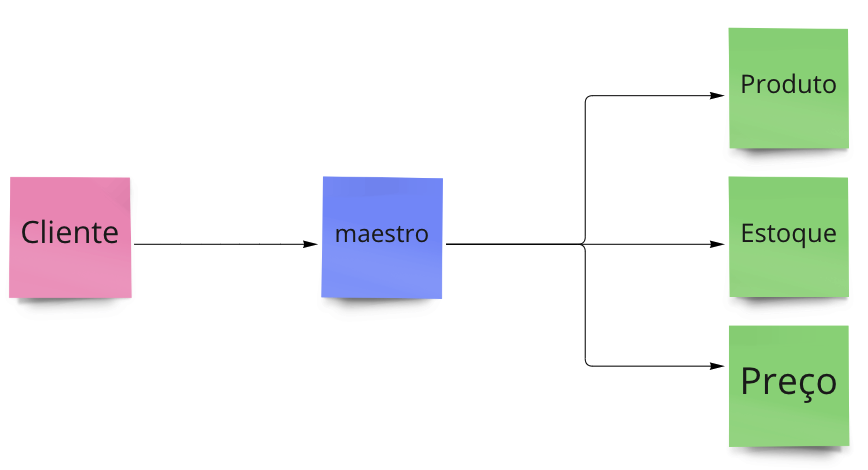

# Solução de Busca
Essa solução contempla 4 microsserviços que simulam um cliente solicitando a um maestro informações completas de produtos.

## Como executar
Dentro de cada projeto, basta executar o arquivo `.py` da raiz de cada subpasta:
* conductor.py
* product.py
* stock.py
* pricing.py

## Dependências
* python > 3.9
* grpc
* grpc_tools
